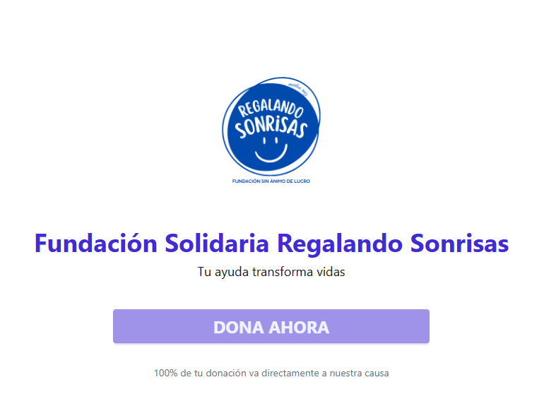
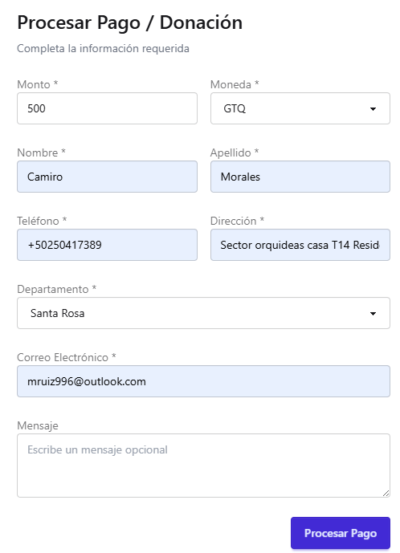
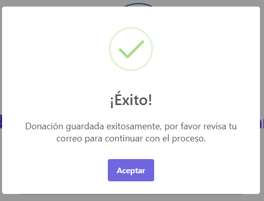
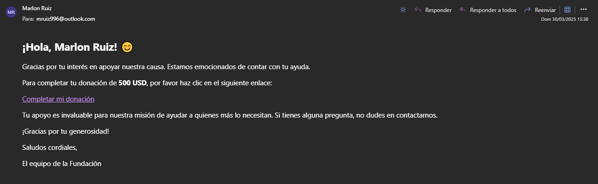
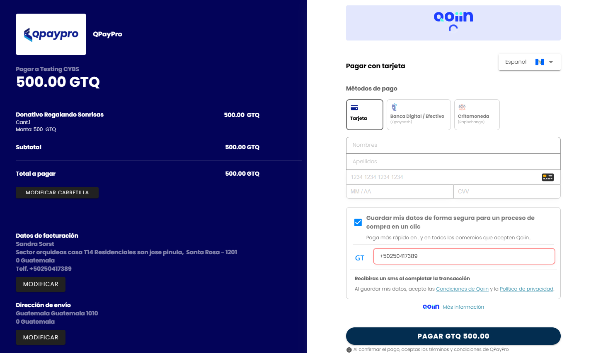
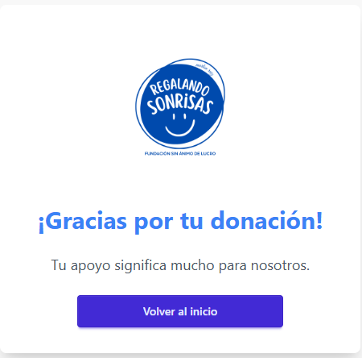
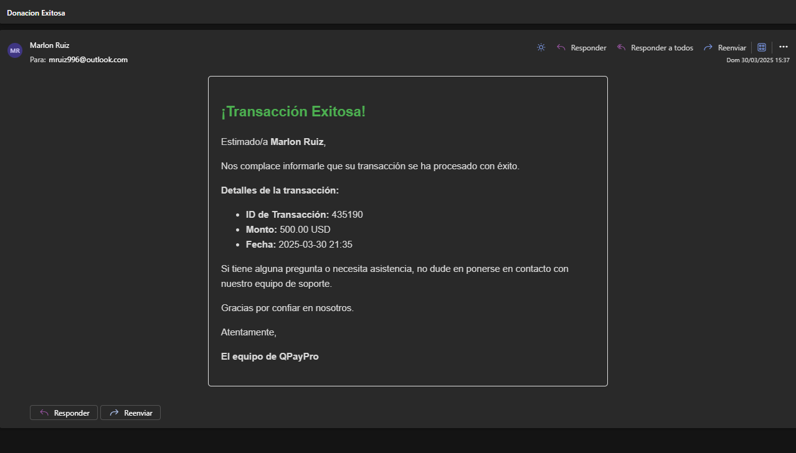
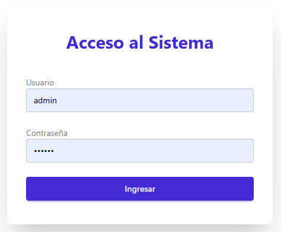
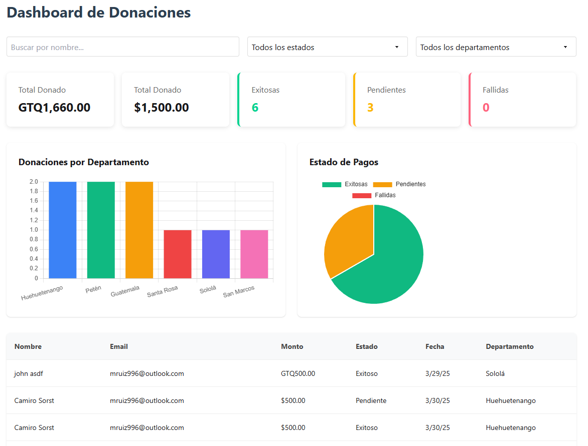

# 🌟 Fundación Regalando Sonrisas

Sistema web completo para gestión de donaciones solidarias. Permite a los usuarios realizar aportes económicos mediante un proceso claro, validado y conectado con la pasarela de pagos **QPayPro**.

---

## ⚙️ Tecnologías utilizadas

| Capa        | Tecnología                                      |
|-------------|-------------------------------------------------|
| Frontend    | Angular 19 + Tailwind CSS + DaisyUI + Chart.js |
| Backend     | Laravel 11 (API RESTful)                        |
| Base de datos | MySQL / MariaDB                              |
| Pasarela de pago | QPayPro (Checkout Page)                   |
| Correo electrónico | Laravel Mail + Plantillas Blade        |
| Seguridad   | Login API protegido con guard (`CanActivate`) en Angular |
| Visualización | Dashboard con gráficas (barras y pie)        |

---

## 📌 Características principales

- Formulario de donación con validaciones (nombre, email, monto, etc.).
- Integración con QPayPro (generación de token + enlace de pago).
- Almacenamiento inicial como **pendiente** en la base de datos.
- Envío de correos automáticos (formulario enviado y pago exitoso).
- Confirmación automática del pago tras éxito en QPayPro.
- Vista de agradecimiento personalizada.
- Login administrativo protegido.
- Panel visual de donaciones en tiempo real.

---

## 🖼️ Capturas del sistema

### 🏠 Vista principal
  
Página de bienvenida con llamado a la acción para iniciar una donación.

### 📝 Formulario de donación
  
Formulario para capturar datos del donante. Se valida antes de generar el token para QPayPro.

### ✅ Confirmación del formulario enviado


### 📩 Correo con link de pago
  
Se envía un correo con enlace al formulario de pago (QPayPro).

### 💳 Checkout Page de QPayPro
> El usuario completa el pago en un entorno seguro de QPayPro (simulado con tarjeta de prueba).
  


### 🎉 Vista de agradecimiento
  
Redirección automática tras pago exitoso.

### 📬 Correo de confirmación de pago exitoso


### 🔐 Login administrativo


### 📊 Dashboard de administración
  
Visualiza métricas, gráficas y estado de cada donación en tiempo real.

---


### 🗃️ Estructura de la Base de Datos

El sistema utiliza tres tablas principales:

---

#### 📄 `donaciones`

| Campo                  | Tipo         | Descripción                                     |
|------------------------|--------------|-------------------------------------------------|
| `id`                   | BIGINT       | Identificador único                             |
| `nombre_completo`      | STRING       | Nombre completo del donante                     |
| `email`                | STRING       | Correo electrónico del donante                  |
| `monto`                | DECIMAL(10,2)| Monto donado                                    |
| `moneda`               | STRING(5)    | Moneda (`GTQ`, `USD`)                           |
| `mensaje`              | TEXT         | Mensaje opcional del donante                    |
| `estado_pago`          | STRING       | `pendiente`, `exitoso`, `fallido`              |
| `factura`              | STRING       | ID de la factura (`x_invoice_num`)             |
| `referencia_transaccion` | STRING     | ID de la transacción en QPayPro                 |
| `metodo`               | STRING       | Método de pago (`CC`, etc.)                     |
| `departamento`         | STRING       | Departamento seleccionado                       |
| `created_at` / `updated_at` | TIMESTAMP | Timestamps automáticos                       |

---

#### 💳 `transacciones`

| Campo                  | Tipo         | Descripción                                     |
|------------------------|--------------|-------------------------------------------------|
| `id`                   | BIGINT       | Identificador único                             |
| `estado`               | STRING       | `exitoso`, `fallido`, etc.                      |
| `codigo_respuesta`     | STRING       | Código devuelto por QPayPro                     |
| `mensaje_respuesta`    | STRING       | Mensaje devuelto por QPayPro                    |
| `referencia_transaccion` | STRING     | ID de la transacción                            |
| `factura`              | STRING       | Número de factura                               |
| `monto`                | DECIMAL(10,2)| Monto pagado                                    |
| `moneda`               | STRING       | Moneda utilizada                                |
| `hash`                 | STRING       | Hash de verificación (`x_MD5_Hash`)             |
| `datos_completos`      | JSON         | Payload completo recibido (para auditoría)      |
| `created_at` / `updated_at` | TIMESTAMP | Timestamps automáticos                       |

---

#### 👤 `usuarios`

| Campo       | Tipo     | Descripción                          |
|-------------|----------|--------------------------------------|
| `id`        | BIGINT   | Identificador único                  |
| `usuario`   | STRING   | Nombre de usuario                    |
| `password`  | STRING   | Contraseña encriptada (bcrypt)       |
| `created_at` / `updated_at` | TIMESTAMP | Timestamps automáticos  |

---

✅ Esta estructura permite registrar la intención de donar, capturar el resultado del pago y proteger el acceso administrativo al sistema.


## 🔄 Flujo resumido

1. Usuario accede a la web y hace clic en **DONA AHORA**.
2. Llena el formulario → se guarda como **pendiente**.
3. Se genera token y se envía un correo con el link de pago.
4. El donante paga mediante QPayPro (Checkout Page).
5. QPayPro notifica al backend (callback).
6. Laravel actualiza el estado de la donación a **exitoso**.
7. Se envía correo de confirmación con ID de transacción.
8. Admin puede visualizar desde el dashboard.

---

## 🧪 Probar la Demo

### 🌐 Sitio
👉 [https://qpaypro.marlonruiz.dev](https://qpaypro.marlonruiz.dev)

1. Haz clic en **Dona Ahora**.
2. Completa el formulario.
3. Revisa tu correo.
4. Completa el pago con los datos de prueba.

### 💳 Datos de tarjeta de prueba

| Campo           | Valor                  |
|----------------|------------------------|
| Número          | `4111 1111 1111 1111`  |
| Vencimiento     | `11 / 27`              |
| CVV             | `123`                  |
| Teléfono        | `+50250417389`         |

---

## 💻 Frontend: Angular 19

- Standalone Components
- Tailwind CSS + DaisyUI
- Reactive Forms
- Angular Router
- AuthGuard (`CanActivate`)
- Consumo de APIs Laravel
- Chart.js para gráficas

### 📁 Estructura principal

- `/inicio`: página de entrada
- `/formulario-donacion`: formulario de captura
- `/gracias`: vista final tras pago
- `/login`: ingreso administrativo
- `/dashboard`: gráficas y control

### ▶️ Ejecutar frontend

```bash
cd Frontend
npm install
ng serve
```

### ⚙️ Levantar el Backend (Laravel 11)

Asegúrate de tener instalado PHP >= 8.2, Composer y una base de datos MySQL/MariaDB.

```bash
cd Backend
composer install
cp .env.example .env
php artisan key:generate
php artisan migrate
php artisan serve
```

